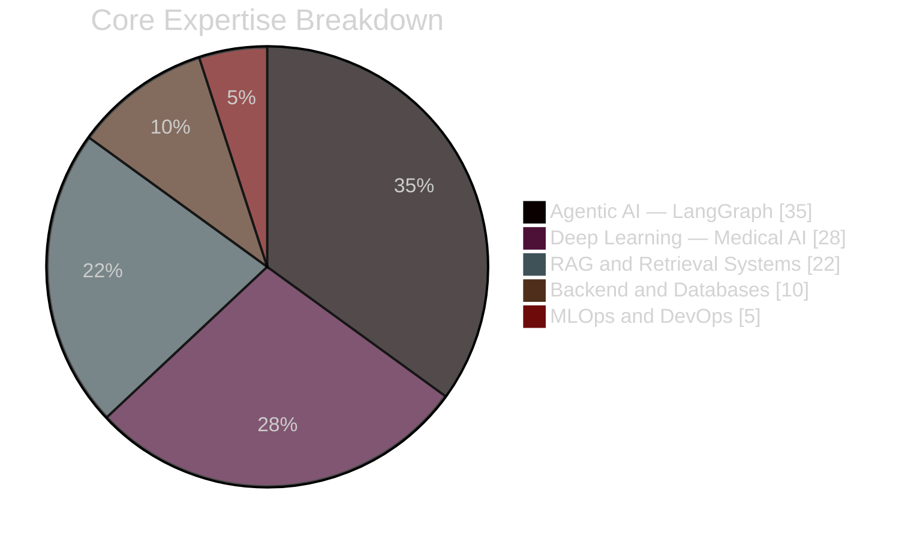
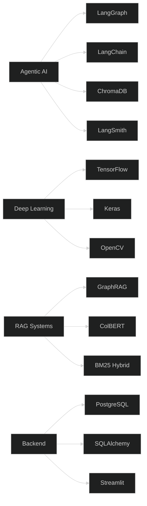

<div align="center">


<br/>

[](https://git.io/typing-svg)

<br/>

[](https://www.linkedin.com/in/arif-khan-71a711376)
&nbsp;
[](mailto:arif.cs.bs@gmail.com)
&nbsp;
[](https://github.com/Arifkhan171)

<br/>


&nbsp;

&nbsp;

&nbsp;


</div>


---

## 👨‍💻 About Me

> *"I don't just build models — I build complete, production-ready AI systems, end-to-end."*

I am an AI Engineer based in 🇵🇰 **Pakistan** with a **BSCS degree** from **University of Loralai** and **3+ years** of experience building AI systems from scratch to production deployment.

<br/>

<table align="center">
<tr>
<td valign="top" width="50%">

| | |
|:---:|:---|
| 🔭 | Building **University AI Chatbot** (5-Agent RAG) |
| 🌱 | Learning **GraphRAG, ColBERT, Advanced LangGraph** |
| 🎯 | Targeting **Remote AI / Agentic AI Engineer** roles |
| 💬 | Ask me about **Agentic AI, LangGraph, Medical DL** |
| ⚡ | Fun fact: **Zero Python to Production AI** in 4 years |
| 📧 | **arif.cs.bs@gmail.com** |

</td>
<td valign="top" width="50%">

<div align="center">

**Skill Proficiency**

<br/>


</div>

</td>
</tr>
</table>

---

## 📊 GitHub Stats

<div align="center">

[](https://github.com/Arifkhan171)

</div>

---

## 🎯 Skills Distribution



---

## 🗺️ Tech Stack Architecture



---

## 🚀 Featured Projects


### 🧠 NeuroAI — Brain Tumor Segmentation & Clinical Analysis System
> Final Year Project — Lead Architect


(https://youtu.be/zeKYup9Rga8)

A clinical-grade AI system for automated MRI-based brain tumor segmentation and clinical report generation.

<details>
<summary><b>🔍 Click to explore project details</b></summary>
<br/>

| Component | Details |
|---|---|
| 📥 **Scan Ingestion** | Automated MRI loading, preprocessing and normalization |
| 🔬 **Multi-Class Detection** | Glioma, meningioma, pituitary, no-tumor classification |
| 🎯 **Boundary Segmentation** | Pixel-level tumor boundaries via CNN encoder-decoder |
| 📋 **Clinical Reports** | Automated per-patient report generation |
| 🖥️ **Interface** | Diagnostic dashboard with visual annotation overlays |

</details>

<br/>


### 📊 Agentic GPA Calculation System
>  End-to-End LangGraph Pipeline — Tech Lead (3-Engineer Team)


(https://youtu.be/Z2Cbma3yKYY)*

A fully autonomous GPA system with Streamlit Human-in-the-Loop dashboard — zero manual calculation.

<details>
<summary><b>🔍 Click to explore project details</b></summary>
<br/>

| Component | Details |
|---|---|
| 📂 **Data Source** | Reads mark sheets directly from Google Drive |
| ✅ **Validation Engine** | 22 edge-case rules enforced via Pydantic v2 |
| 🧮 **GPA Engine** | HEC Pakistan formula — GPA and CGPA with letter grades |
| 🗄️ **Data Layer** | SQLAlchemy ORM to PostgreSQL / SQLite with audit trails |
| 📜 **Transcripts** | Auto-generates formatted student transcripts |
| 🖥️ **Dashboard** | Streamlit HITL review with approval workflow |
| 👥 **Team** | Led 3-engineer team with full GitHub branch and PR workflow |

</details>

<br/>


### 🎓 University AI Chatbot — 5-Agent RAG System
> Production System — In Active Development


(https://youtu.be/YpSCygFuMA8)

A production-grade university chatbot on a 5-specialist-agent LangGraph architecture with advanced retrieval.

<details>
<summary><b>🔍 Click to explore project details</b></summary>
<br/>

| Component | Details |
|---|---|
| 🤖 **Agent Architecture** | 5 specialist agents: Admissions, Academic, Events, Library, General |
| 🔍 **Hybrid Retrieval** | ChromaDB dense + BM25 sparse via Reciprocal Rank Fusion |
| 🎯 **Reranking** | Cross-encoder reranking for precision-optimized results |
| 🕸️ **GraphRAG** | Knowledge graph-enhanced multi-hop retrieval |
| 🔄 **CRAG** | Corrective RAG for hallucination reduction |
| 🗂️ **Parent-Child** | Hierarchical chunk retrieval for context coherence |
| 🌐 **Multilingual** | Planned: English, Urdu, Pashto |
| 📊 **Observability** | Full tracing and evaluation via LangSmith |

</details>

<br/>


---

## 🛠️ Technology Arsenal

<div align="center">

[](https://skillicons.dev)

<br/>

**Agentic AI**


**Deep Learning and ML**


**Backend and Databases**


**Tools**


</div>

---

## 📅 My AI Journey

<div align="center">

```
╔══════════════════════════════════════════════════════════════════════╗
║                     ARIF'S  AI  JOURNEY                            ║
╠══════════════════════════════════════════════════════════════════════╣
║  2022  ✦  Python from scratch  •  First algorithms  •  Curiosity  ║
║  2023  ✦  Feature Engineering  •  ML Algorithms  •  Real projects  ║
║  2024  ✦  Deep Learning  •  CNNs  •  Medical AI  NeuroAI FYP       ║
║  2025  ✦  Agentic AI  •  LangGraph  •  Multi-Agent RAG Systems     ║
║  2026  ✦  BSCS Graduate  •  Production AI Systems  •  Remote Work  ║
╚══════════════════════════════════════════════════════════════════════╝
```

</div>

---

<div align="center">


<br/>

### Let's Build Something Together

**Seeking remote AI Engineer and Agentic AI Engineer roles**

<br/>

[](https://www.linkedin.com/in/arif-khan-71a711376)
&nbsp;&nbsp;
[](mailto:arif.cs.bs@gmail.com)

<br/>

*If my work inspires you — a star on any repo means the world to me!*

<br/>

</div>


